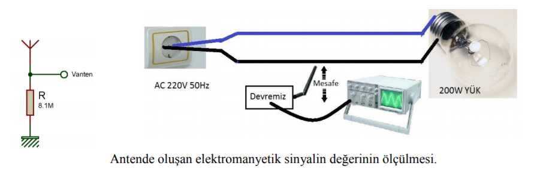
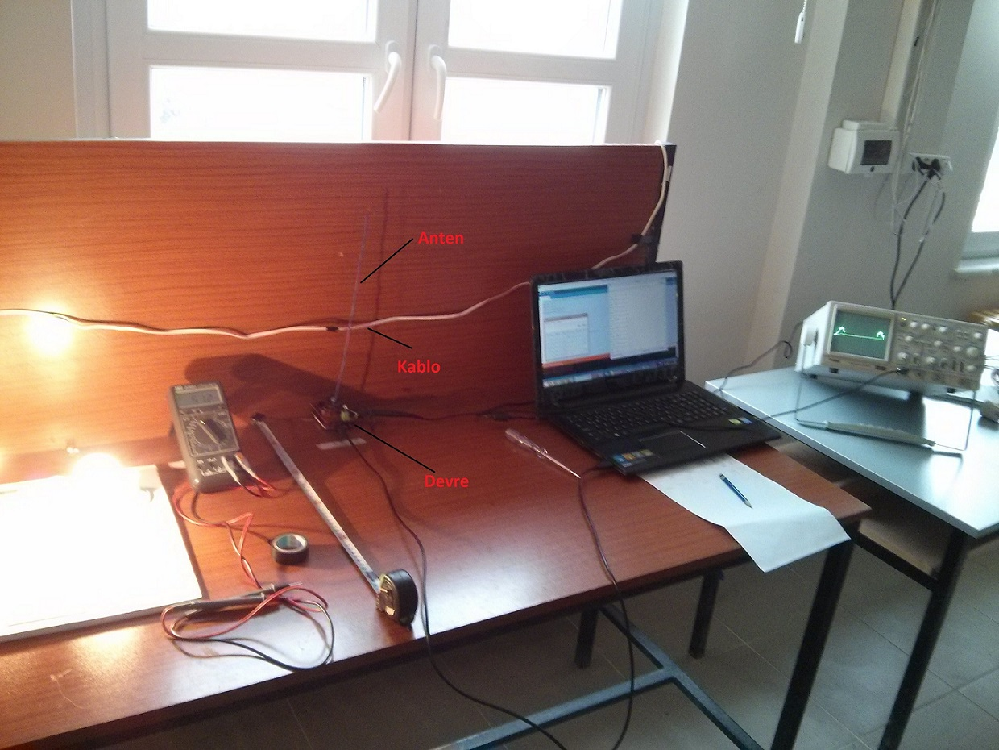
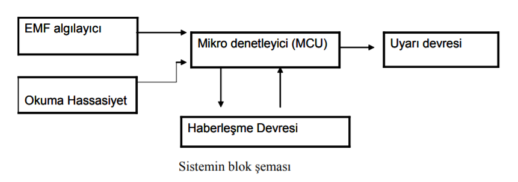

## **NON-CONTACT ELECTRICITY-SENSING HELMET**

### Introduction :
One of the energy sources that we cannot give up in our lives is electrical energy. It is seen in TEİAŞ data that our country is 1500 km from east to west and 650 km from north to south (İNCEKARA, 2008) and the total electricity transmission length is 53709.3 km ("Türkiye Elektrik İletim A.Ş." .”). On the walls of our homes, on the streets, in our workplaces, etc. We live with these lines everywhere, all around us. These lines over time it is getting old and need repair and maintenance.

During maintenance and repair operations, the request form for line cutting is first filled out and given to the relevant distribution company to request that the line be cut at the required place and time (“Electricity Network Management”). In different lines of business, power must be cut first. This is one of the points where human error is most common, causing electrical accidents. In addition to the above equipment, a control pen, voltmeter, etc. can be added to understand the presence of electricity. Despite these, electrical accidents do occur and can have dire consequences.

### **The goal of the project:**
Based on the point we explained above, we decided to develop a helmet that is simple, portable, easy to use, can be easily used in every line of work, and can detect electrical energy present for any reason from a certain distance. This helmet should also be able to report the situation to the centre.
Thus, a new equipment will be developed.

### **Methods:**

The experimental circuit in Figure 1 was established to understand the existence and value of the electromagnetic field created by the main voltage on the conductive wire in an antenna. In this experiment, the voltage created by the electromagnetic field created by the 220V, 50Hz mains voltage on the conductor wire under constant load on an antenna was measured with an oscilloscope. During the measurements, the antenna was kept in an upright position and was moved away from the cable connected to the load at regular intervals.

Similar studies to this study have been conducted with different antenna types (“Very Low-Frequency Electromagnetic Field Detection”). When we examine these, we see that the 50Hz mains voltage falls into the EVLF (Extremely Very Low Frequency) band. In these applications, the signal at the antenna output is first amplified and then applied to active filters and the desired value is obtained and sent to other circuits ("Very Low-Frequency Electromagnetic Field Detection").

We found that the shapes of the circuits we examined were quite complex. The system we will apply in our study, unlike these circuits, will only be sufficient to detect the presence or absence of electricity and will not have a central location.
Since the state must be transmitted, a microcontroller circuit is needed for the communication process.

<a href="https://youtu.be/xw7cg5efln4" target="_blank"> 

Click for working video.
</a>

### **What is the subject of the project?** :

- Microcontrollers, Arduino Uno (Atmega328P)
- Electric and magnetic field
- Bluetooth communication
- Arduino coding with C++.

### Note: 
This study was published in TUBITAK 47th SECONDARY EDUCATION STUDENTS RESEARCH PROJECTS COMPETITION (2016).
It was exhibited at the regional exhibition.

