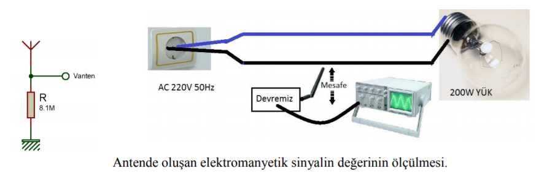
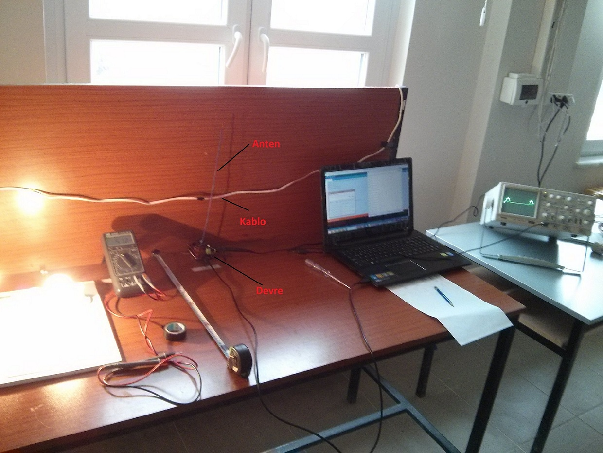
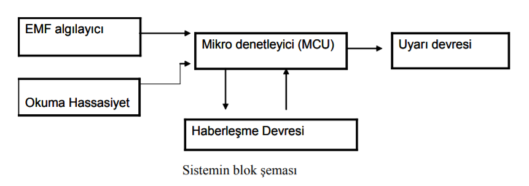

## **TEMASSIZ ELEKTRİK ALGILAYAN KASK**

### Giriş :

Hayatımızda vazgeçemeyeceğimiz enerji kaynaklarından bir tanesi elektrik enerjisidir.Ülkemizin doğudan-batıya 1500 km ve kuzeyden-güney 650 km olduğu (İNCEKARA,2008) ve elektrik iletim uzunluğunun toplamda 53709,3 km'yi bulduğu TEİAŞ verilerinde görülmektedir(“Türkiye Elektrik İletim A.Ş.”). Evlerimizin duvarlarında, sokaklarda, iş yerlerimizde vb. her yerde, her yanımızda bu hatlarla beraber yaşamaktayız. Bu hatlar zamanla
eskimekte tamir ve bakıma ihtiyaç duyulmaktadır.

Bakım onarım işlemleri sırasında ise öncellikle hat kesimi ile ilgili istek formu doldurulup
ilgili dağıtım kuruluşuna verilerek gerekli yer ve zamanda hattın kesilmesi talep edilmektedir
(“Elektrik Şebeke İşletmeciliği”). Farklı iş kollarında ise öncelikle enerji kesilmesi gerekmektedir.
İşte bu nokta, elektrik kazalarına sebep olan insan hatasının en çok olduğu noktalardan biridir.
Yukarıdaki ekipmanlara ek olarak, elektriğin varlığını anlamak için kontrol kalemi, voltmetre vb.
eklenebilir. Bunlara rağmen elektrik kazaları olmakta ve vahim sonuçlar doğurabilmektedir.

### **Projenin Amacı :**
Biz de yukarıda anlatılan noktadan yola çıkarak basit, taşınabilir, kolay kullanılabilen ve
maliyeti ucuz her iş kolunda rahatlıkla kullanılabilecek ve çalışılan alana yaklaşırken veya alanda
iken herhangi bir sebepten dolayı var olan elektrik enerjisini belli bir mesafeden (dokunma olmaksızın) algılayıp hem çalışan kişiye hem de merkezi bir yere durumu rapor edebilen bir kask
geliştirmeye karar verdik.
 Böylelikle mevcut var olan donanımlara ek olarak iş ve çalışma güvenliğini daha da
arttıracak bir donanım kullanıma sunulmuş olacaktır.

### **Yöntem :**

İletken teldeki şebeke geriliminin bir antende oluşturduğu elektromanyetik alanın varlığını ve değerini anlamak için şekil 1'deki deney devresi kurulmuştur. Bu deneyde 220V, 50Hz’lik şebeke geriliminin sabit yük altında, iletken telde oluşturduğu elektromanyetik alanın bir antende meydana getirdiği gerilim osilaskopla ölçülmüştür. Ölçümler sırasında anten dikey konumda
tutularak yüke bağlanan kablodan belirli aralıklarla uzaklaştırılmıştır.

Bu çalışmanın benzerleri farklı anten tipleri ile de yapılmıştır(“Very Low Frequency
Electromagnetic Field Detection”). Bunları incelediğimizde ise 50Hz’lik şebeke geriliminin EVLF(Extremely Very Low Frequency- Aşırı Düşük Frekans) bandına girdiğini görmekteyiz. Bu
uygulamalarda anten çıkışındaki sinyal önce yükseltilmiş daha sonra ise aktif filtrelere uygulanmış
ve arzu edilen değer elde edilerek diğer devrelere gönderilmiştir(“Very Low FrequencyElectromagnetic Field Detection”).

İncelediğimiz bu devrelerin bu şekilleriyle çok karmaşık yapıda olduklarını gördük. Bu devrelerden farklı olarak bizim çalışmamızda gerçekleştirecek olduğumuz sistemin sadece şebekenin varlığını ya da yokluğunu algılanması yeterli olacağından ve merkezi bir yere var olma
durumunu iletmesi istenileceğinden haberleşme işlemi için bir mikrodenetleyici devreye ihtiyaç duyulmaktadır. 

[Ornek Çalışma videosu için tıklayınız...](https://youtu.be/xw7cg5efln4)

### **Projenin konusu?** :

- Mikrodenetleyiciler, Arduino Uno (Atmega328P)
- Elektrik ve manyetik alan
- Bluetooth haberleşme
- C++ ile arduino kodlama.

### Not: 
Bu çalışma TUBİTAK 47. ORTAÖĞRETİM ÖĞRENCİLERİ ARAŞTIRMA PROJELERİ YARIŞMASI (2016)
bölge sergisinde sergilenmiştir.

